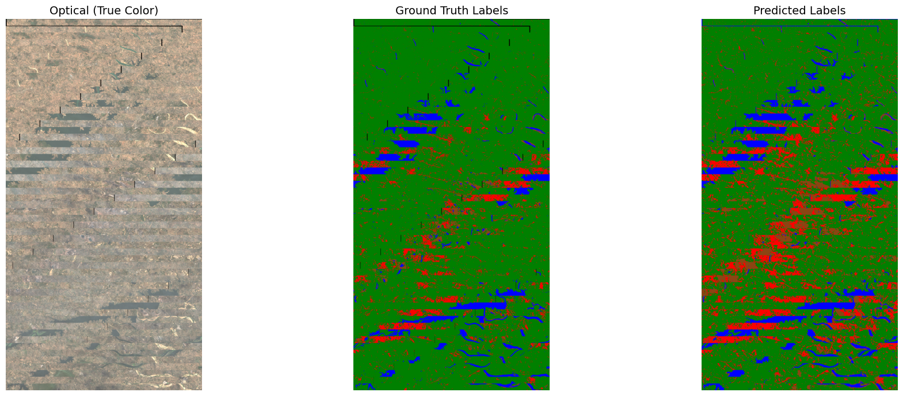

# Multi-Sensor Land Cover Classification using SAR and MSI

## Problem
Land cover mapping is critical for environmental monitoring, urban planning, and resource allocation. 
Traditional optical sensors fail under cloud cover, haze, and smoke. 
By fusing Sentinel-1 SAR with Sentinel-2 optical data, this project enables all-weather, day-night land cover classification.

## Area of Interest
AOI- Dhanbad-Asansol-Maithon Region
Date of Acquisition: 10/02/2026
Source: Sentinel-1 and Sentinel-2

## Data Pipeline
### Sentinel-1 SAR
For processing of SAR, each band was processed individually as follows:
	>Applied Orbit File
	> Performed TNR
	> Radiometric Calibration
	> Speckle Filtering
	> Terrain Correction
The resulting files were stacked and clipped according to the AOI

### Sentinel-2 MSI
For MSI, the bands were stacked and clipped to the AOI. 

### Label Generation
2 tiles of ESA WorldCover had to be merged and remapped to 4 classes (along with 0 marking unknown)

### Tiling
1595 tiles of 128×128 pixels for each of MSI,SAR, and Labels 
Train/Val/Test split: 70% / 15% / 15%
Input shape after fusion per tile: (6, 128, 128)
Label shape per tile: (128, 128)

## Model Architecture
Model: Lightweight U-Net for Pixel-level Segmentation

U-Net performs pixel-level segmentation unlike standard CNNs which classify entire images. Skip connections preserve spatial detail lost during downsampling.

Encoder  : 6→16→32→64 channels
Bottleneck: 128 channels
Decoder  : 64→32→16 channels
Skip connections at each level
Output   : 5 class segmentation map
Loss     : Weighted CrossEntropyLoss to handle class imbalance
          (handles 87% vegetation dominance)
          Class Distribution:
            Vegetation : 87.4%  weight=0.23
            Urban      : 5.2%   weight=3.81
            Barren     : 1.3%   weight=15.00
            Water      : 4.9%   weight=4.09

## Results
| Class      | IoU   |
|------------|-------|
| Vegetation | 0.858 |
| Urban      | 0.445 |
| Barren     | 0.179 |
| Water      | 0.544 |
| **mIoU**   | **0.532** |

Pixel Accuracy: 86.57%

## Visualization
Re-Stitched Optical image vs Ground Truth Label vs Predicted Label


## Known Limitations
 1. Barren Class Underperformance: Barren/Mining covers only 1.3% of pixels. 
    Despite class weighting (15.0), the model achieves only 0.179 IoU on this class due to insufficient training examples.

 2. Boundary Artifacts: 83,629 zero-valued pixels detected in optical bands corresponding to Sentinel-2 granule boundaries. 
    These appear as horizontal dark strips in the RGB composite.

 3. Model was trained and evaluated on a single AOI (Asansol region). 
    Generalization to other geographic regions or seasons is untested.

 4. Tile Edge Discarded:
    Pixels at the right and bottom edges of the raster that don't fit into 128×128 tiles were discarded during preprocessing.

## How to Run

### Dependencies
```
pip install torch rasterio numpy matplotlib
```

### Steps
1. Download Sentinel-1 and Sentinel-2 data from Copernicus Browser
2. Run SAR preprocessing in SNAP
3. Run `stackOptical.py` and `stackSAR.py`
4. Run `TileGeneration.py`
5. Run `training.ipynb`
6. Run `visualize.ipynb`

